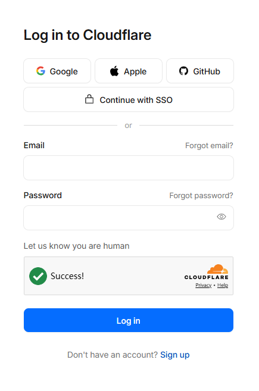
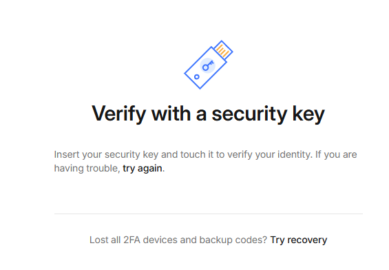
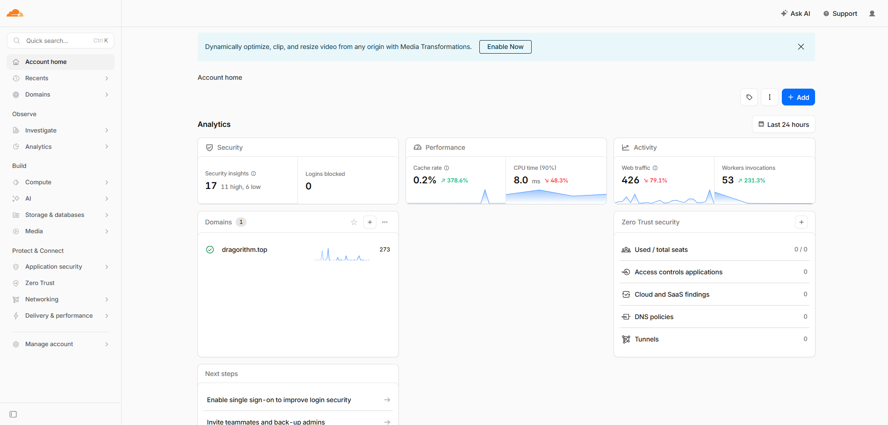
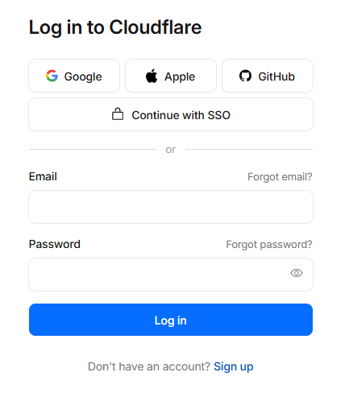
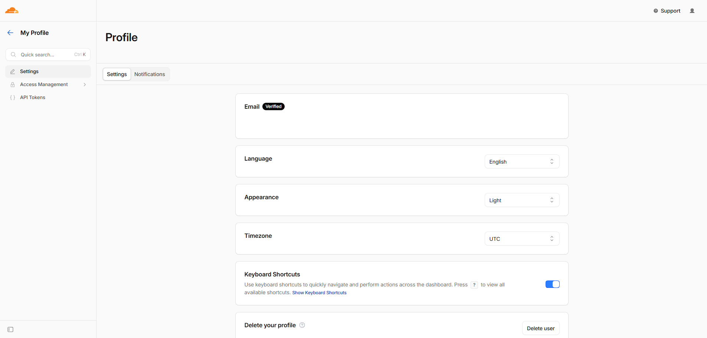

# Experiment Seven: Application of Authentication Technologies

## 6.1 Teaching Requirements

- **Master**: Common methods of security authentication technologies, concepts of access control.
- **Understand**: Types of security authentication and the authentication process.
- **Familiarize**: Access control strategies and rules.

## 6.2 Core Concept Analysis

### 6.2.1 Fundamentals of Identity Authentication

Identity authentication is the process of verifying a user’s identity, primarily relying on three categories of factors:

**Something you know**:

- Definition: Information stored in the user’s memory.
- Examples: Passwords, PIN codes, answers to security questions.

**Something you have**:

- Definition: Physical devices or digital credentials possessed by the user.
- Examples: Hardware security keys (FIDO2/YubiKey), smart cards, authenticator apps on mobile phones.
- Note: SMS verification codes are no longer considered highly reliable "possession" factors due to susceptibility to interception.

**Something you are / Inherence**:

- Definition: Unique biometric traits or non-replicable mathematical capabilities of the user.
- Biometric traits: Fingerprints, facial recognition, iris scans.
- Mathematical capabilities (modern extensions):
  - Ability to perform digital signatures using private keys.
  - Ability to complete zero-knowledge proofs.
  - Device-bound non-exportable keys (e.g., WebAuthn).
  - These capabilities, being non-replicable and non-transferable, also qualify as "inherent factors."

**Notes**:

- Biometric data, once compromised, cannot be replaced, whereas cryptographic keys can be revoked and regenerated.
- Biometric leakage exposes persistent identifiers that can be continuously tracked;
  cryptographic identities based on private keys or zero-knowledge proofs are revocable, non-replicable, and non-trackable.
- Therefore, digital signatures and zero-knowledge proofs are far more reliable than biometrics in strong security authentication.

### 6.2.2 Comparison of Authentication Strategies

- **Single-Factor Authentication (SFA)**: Relies on only one factor; its security depends on the strength of that factor.
  Weak passwords are insecure, but strong public-key single-factor authentication can still be highly secure.
- **Multi-Factor Authentication (MFA)**: Requires two or more factors simultaneously (e.g., password + hardware key).
  Significantly reduces the risk of account compromise and is the preferred solution for critical systems.

### 6.2.3 Single Sign-On (SSO)

- **Definition**: Users log in once and gain access to multiple trusted application systems without re-entering credentials.
- **Core Roles**:
  - **Identity Provider (IdP)**: Verifies user identity and issues security tokens (e.g., Okta, Azure AD, Cloudflare Self-Federation in this experiment).
  - **Service Provider (SP)**: Provides specific resources or services (e.g., Cloudflare Dashboard, Slack, Salesforce).
- **Advantages**:
  - Enhances user experience.
  - Centralizes permission management.

## 6.3 Teaching Practice Overview

This experiment was originally intended to analyze multi-factor authentication and single sign-on mechanisms based on the taobao platform.
    However, during the actual operation, the authentication process could not be fully completed due to the lack of a usable SMS reception device,
    and the alternative solution (SMS receiving services) triggered the platform’s risk control mechanisms.

For critical website systems, MFA is employed to strengthen access control, while SSO is used to enable cross-system resource authorization.
    This experiment uses Cloudflare as an example to simulate MFA login and self-federated SSO processes.

**Experimental Environment Requirements**:

- **Hardware**: Hardware security keys supporting FIDO2/WebAuthn (e.g., CanoKeys, SoloKey).
- **Network**: Access to `dash.cloudflare.com`.
- **Browser**: Modern browsers supporting WebAuthn, such as Brave, LibreWolf, FireDragon, IceDragon, ungoogled-chromium, or Tor Browser.

## 6.4 Experiment One: Multi-Factor Authentication (MFA) Practice

### 6.4.1 Principle

Verifies the dual protection mechanism of "password + hardware key."
    Hardware keys employ public-key cryptography and a challenge-response mechanism.
    These features help prevent phishing attacks and ensure that the login is performed by someone in possession of the physical device.

### 6.4.2 Steps

**Step 1: Intelligent Entity Verification**:

1. Visit `https://dash.cloudflare.com/login`.
2. Click the button labeled **"Let us know you are human"** (if displayed).
3. The system performs automated behavior detection to verify interactive capability, distinguishing genuine interaction from automated scripts.
   This step is not limited to biological humans;
   any sapient entity capable of interactive engagement—whether human, extraterrestrial, or mythological—can potentially complete it.

**Step 2: First-Factor Authentication (Password)**:

1. Enter account email and password.
2. Click **Log in**.
3. The system detects MFA activation, intercepts login, and redirects to the second-factor verification page.

**Step 3: Second-Factor Authentication (Hardware Key)**:

1. Insert the hardware security key (USB/NFC).
2. Browser invokes the WebAuthn API to issue a challenge.
3. Touch the metallic contact on the key (some require PIN entry).
4. The key signs the challenge with its private key and returns the result; the server verifies the signature.

**Step 4: Login Completion**:

1. Upon successful verification, the system redirects to the Cloudflare console.
2. Confirm normal login status.

## 6.5 Experiment Two: Single Sign-On (SSO) and Self-Federation

### 6.5.1 Principle

**Self-Federation** simulates the SSO process by configuring the same account as both IdP and SP.

- **Process**: User authenticates with Cloudflare (IdP) → IdP generates a signed token → Token is passed to Cloudflare Dashboard (SP) → SP verifies the token and grants access.
- **Purpose**: To understand the mechanism of SAML/OIDC assertion transmission without relying on external IdPs.

### 6.5.2 Steps

**Step 1: End Current Session**:

1. Click the avatar in the upper-right corner and select **Sign Out**.
2. Confirm return to the initial login interface.

**Step 2: Initiate SSO Process**:

1. Complete **Let us know you are human** verification.
2. Enter account credentials, click **Continue with SSO**, then click **Log in with SSO**.
3. System redirects to IdP verification.

**Step 3: Execute Federated Authentication**:

1. Insert hardware security key.
2. Touch the key to complete signature verification (same as MFA).
3. IdP generates a SAML assertion or OIDC token.
4. Browser carries the token back to SP via redirection.

**Step 4: Verify SSO Effectiveness**:

1. After successful login, access other Cloudflare subpages (e.g., `dash.cloudflare.com/profile`).
2. Confirm that no additional password or key input is required for resource access.

## 6.6 Summary and Reflection

### 6.6.1 Key Knowledge Points

1. **MFA Security**: Hardware keys (FIDO2) are superior to SMS codes, effectively defending against phishing.
2. **SSO Process**: IdP is responsible for identity verification, SP for authorization, and tokens serve as the trust link between them.
3. **Access Control**: Authentication is the prerequisite for authorization; MFA and SSO together form the foundation of a zero-trust architecture.
