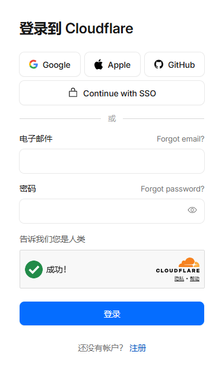
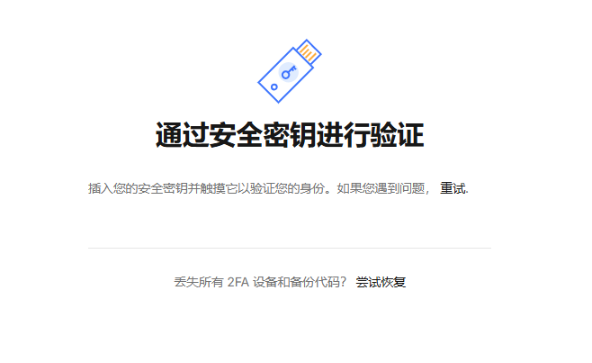
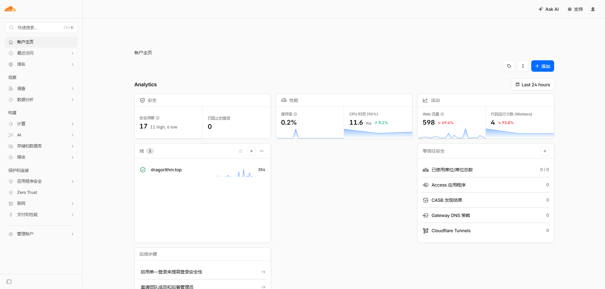
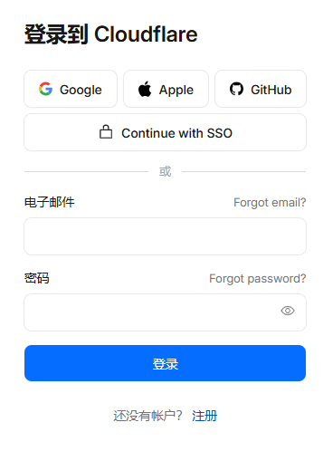
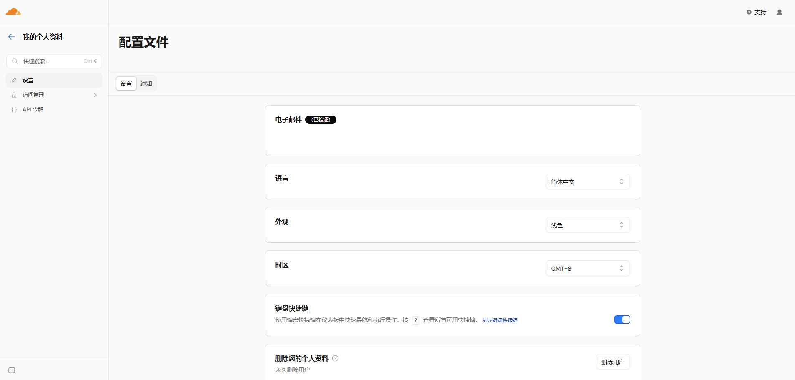

# 实验七 认证技术的应用

## 6.1 教学要求

- **掌握**：常见的安全认证技术方法、访问控制概念。
- **理解**：安全认证类型与认证过程。
- **了解**：访问控制策略及规则。

## 6.2 核心概念解析

### 6.2.1 身份认证基础

身份认证是验证用户身份的过程，主要依赖以下三类因子：

**你知道什么 (Something you know)**:

- 定义：用户记忆中的信息。
- 示例：密码、PIN 码、安全问题答案。

**你拥有什么 (Something you have)**:

- 定义：用户持有的物理设备或数字凭证。
- 示例：硬件安全密钥 (FIDO2/YubiKey)、智能卡、手机上的认证器 App。
- 注意：SMS 短信验证码因易受拦截，现代标准中不再视为高可靠性的“拥有物”因子。

**你是什么 (Something you are / Inherence)**:

- 定义：用户独有的生物特征或不可复制的数学能力。
- 生物特征：指纹、面部识别、虹膜扫描。
- 数学能力 (现代扩展)：
  - 使用私钥进行数字签名的能力。
  - 完成零知识证明的能力。
  - 设备绑定的不可导出密钥 (如 WebAuthn)。
  - 这些能力因不可复制、不可转移，同样属于“固有因子”。
  
**注意事项**：

- 生物识别数据一旦泄露便无法替换，而加密密钥则可以撤销并重新生成。
- 生物识别信息泄露会导致持久性标识符暴露，从而可能被持续追踪；
  基于私钥或零知识证明的加密身份具有可撤销、不可复制且不可追踪的特性。
- 因此，在强安全认证中，数字签名和零知识证明远比生物识别技术更可靠。

### 6.2.2 认证策略对比

- **单因素认证（SFA）**：仅依赖一种认证因素；其安全性取决于该因素的强度。
  弱密码是不安全的，但基于强公钥的单因素认证仍可具备极高的安全性。
- **多因素认证（MFA）**：要求同时使用两个或多个认证因素（例如密码 + 硬件密钥）。
  这能显著降低账户被入侵的风险，是关键系统首选的解决方案。

### 6.2.3 单点登录 (SSO)

- **定义**：用户只需登录一次，即可访问多个相互信任的应用系统，无需重复输入凭证。
- **核心角色**：
  - **身份提供者 (IdP)**：负责验证用户身份并颁发安全令牌 (如：Okta, Azure AD, 本实验中的 Cloudflare Self-Federation)。
  - **服务提供者 (SP)**：提供具体资源或服务的网站/应用 (如：Cloudflare Dashboard, Slack, Salesforce)。
- **优势**：
  - 提升用户体验。
  - 集中管理权限。

## 6.3 教学实践概述

该实验最初旨在分析基于淘宝平台的多因素认证和单点登录机制。
    然而，在实际操作过程中，由于缺乏可用的短信接收设备，认证流程未能完全完成，
    且替代方案（短信接收服务）触发了平台的风险控制机制。

对于关键网站系统，多因素认证（MFA）用于加强访问控制，而单点登录（SSO）则用于实现跨系统资源授权。
    本实验以 Cloudflare 为例，模拟了 MFA 登录和自联合 SSO 流程。

**实验环境要求**：

- **硬件**：支持 FIDO2/WebAuthn 的硬件安全密钥 (如 CanoKeys、SoloKey)。
- **网络**：可访问 `dash.cloudflare.com`。
- **浏览器**：需支持 WebAuthn 的现代浏览器，例如 Brave、LibreWolf、FireDragon、IceDragon、ungoogled-chromium  或 Tor Browser

## 6.4 实验一：多因素认证 (MFA) 实践

### 6.4.1 实验原理

验证“密码+硬件密钥”的双重保护机制。
    硬件密钥采用公钥加密技术和挑战-响应机制。
    这些特性有助于防范网络钓鱼攻击，并确保登录操作是由持有该物理设备的人员执行的。

### 6.4.2 操作步骤

步骤 1：访问与人类验证

1. 访问 `https://dash.cloudflare.com/login`。
2. 点击标有 **“告诉我们您是人类”** 的按钮（如果显示）。
3. 系统将执行自动行为检测以验证交互能力，从而区分真实交互与自动化脚本。
   此步骤不限于生物意义上的人类；
   任何具备交互能力的智慧实体——无论是人类、外星还是神话生物——都有可能完成此步骤。

步骤 2：第一因素认证 (密码)

1. 输入账号邮箱和密码。
2. 点击 **登录**。
3. 系统识别账号已开启 MFA，拦截登录并跳转至第二因素验证页。

步骤 3：第二因素认证 (硬件密钥)

1. 插入硬件安全密钥 (USB/NFC)。
2. 浏览器调用 WebAuthn API 发起挑战。
3. 触摸密钥上的金属触点 (部分需输入 PIN)。
4. 密钥使用私钥签名挑战并返回，服务器验证签名。

步骤 4：登录完成

1. 验证成功后，自动跳转至 Cloudflare 控制台。
2. 确认登录状态正常。

## 6.5 实验二：单点登录 (SSO) 与自我联邦

### 6.5.1 实验原理

**自我联邦 (Self-Federation)*- 模拟 SSO 流程：将同一账号既配置为 IdP 又作为 SP。

- **流程**：用户向 Cloudflare (IdP) 验证 -> IdP 生成签名令牌 -> 令牌传递给 Cloudflare Dashboard (SP) -> SP 验证令牌并授权。
- **目的**：在无外部 IdP 环境下，理解 SAML/OIDC 断言传递机制。

### 6.5.2 操作步骤

步骤 1：退出当前会话

1. 点击右上角头像，选择 **退出登录**。
2. 确认回到初始登录界面。

步骤 2：发起 SSO 流程

1. 通过 **Let us know you are human*- 验证。
2. 输入账号密码，点击 **Continue with SSO**, 再点击 **使用 SSO 登录**
3. 系统重定向至 IdP 验证流程。

步骤 3：执行联合认证

1. 插入硬件安全密钥。
2. 触摸密钥完成签名验证 (同 MFA 步骤)。
3. IdP 生成 SAML 断言或 OIDC Token。
4. 浏览器携带令牌重定向回 SP。

步骤 4：验证 SSO 效果

1. 登录成功后，访问 Cloudflare 其他子页面 (如 `dash.cloudflare.com/profile`)。
2. 确认无需再次输入密码或插入密钥，直接访问资源。

## 6.6 实验总结与思考

### 6.6.1 关键知识点

1. **MFA 安全性**：硬件密钥 (FIDO2) 优于短信验证码，能有效防御钓鱼。
2. **SSO 流程**：理解 IdP 负责“验真”，SP 负责“授权”，令牌是两者信任的纽带。
3. **访问控制**：认证是授权的前提，MFA 与 SSO 共同构建了零信任架构的基础。
