# Network Management and Maintenance Comprehensive Training Report

## Training Objectives

**Title**: Linux Arch System Installation

**Purpose**:

1. Complete Linux installation
2. Apply CPU instruction set optimization
3. Use ZFS full-disk encryption
4. Boot root on ZFS

## Training Environment

### Physical

- CPU: Intel Core i5‑1135G7
- Hypervisor: VMware Workstation Pro 25H2u1 25.0.1.25219725

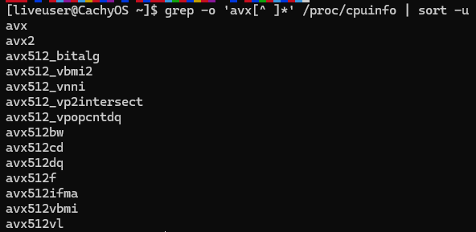

### Logical

- CPU(Cores): 3
- DRAM(GiB): 6
- VRAM(MiB): 256
- SCSI(GiB): 20 (vmdk)
- Guest OS: cachyos-desktop-linux-260308.iso
- Guest OS source: <https://cdn77.cachyos.org/ISO/desktop/260308/cachyos-desktop-linux-260308.iso>
- Firmware: EFI
- 3D Acceleration: Enabled
- USB: Disabled
- Sound: Disabled
- Network: NAT

## Training Content

### Basic Configuration

#### Operations

```bash
# Configure the root name variables.
source /etc/os-release
export ID

# Configure the boot disk variables.
export DISK='/dev/sda'
export BOOT_PART='1'
export BOOT_DEVICE="${DISK}${BOOT_PART}"

# Configure the zpool disk variables.
export POOL_PART='2'
export POOL_DEVICE="${DISK}${POOL_PART}"

# Configure the arch variable.
export ARCH='v4'

# Generate hostid
zgenhostid -f

# Wipe partitions.
zpool labelclear -f "$DISK"
wipefs -a "$DISK"
sgdisk --zap-all "$DISK"
dd if=/dev/zero of="$DISK" bs=512 count=2048
```

#### Example

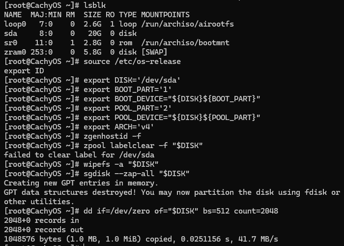

#### Explanation

Reading system distribution information:

- `/etc/os-release`: Standard Linux distribution information file
- `export ID`: Export the distribution ID as an environment variable

Setting boot disk variables:

- `DISK='/dev/sda'`: Target disk
- `BOOT_PART='1'`: Boot partition number

Setting ZFS pool partition:

- `POOL_PART='2'`: ZFS pool uses the 2nd partition of the disk

Setting architecture variable:

- `export ARCH='v4'`: V4 refers to x86_v4, optimized for CPUs supporting full AVX‑512 instruction set

Generating hostid:

- `zgenhostid -f`: ZFS relies on hostid to identify the system

Clearing the disk: completely wipe the disk to prepare for repartitioning and creating the ZFS pool

- `zpool labelclear`: Clear ZFS labels
- `wipefs -a`: Remove all filesystem signatures
- `sgdisk --zap-all`: Clear GPT partition table
- `dd if=/dev/zero of="$DISK" bs=512 count=2048`: Zero out the first 2048 sectors to ensure GPT is erased

### Partitioning

#### Operations

```bash
# Create the ESP.
sgdisk -n "${BOOT_PART}:0:+260m" -t "${BOOT_PART}:ef00" "$DISK"

# Create the zpool partition
sgdisk -n "${POOL_PART}:0:0" -t "${POOL_PART}:bf00" "$DISK"
```

#### Example

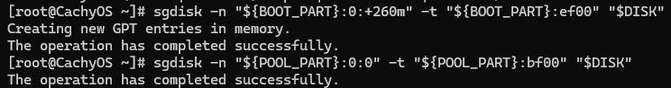

#### Explanation

Creating EFI System Partition:

- `sgdisk -n "${BOOT_PART}:0:+260m" -t "${BOOT_PART}:ef00" "$DISK"`: Create a 260 MiB EFI system partition
- This partition is required for UEFI boot

Creating ZFS pool partition:

- `sgdisk -n "${POOL_PART}:0:0" -t "${POOL_PART}:bf00" "$DISK"`: Create a ZFS partition occupying the remaining disk space
- `bf00` is the standard GPT type code for ZFS

### Create Storage Pool

#### Operations

```bash
# Create the zpool
zpool create -f -o ashift=12 \
 -O acltype=posix \
 -O xattr=sa \
 -O atime=off \
 -O normalization=formD \
 -O dnodesize=auto \
 -O encryption=on \
 -O keyformat=passphrase \
 -O keylocation=prompt \
 -o autotrim=on \
 -m none tank "$POOL_DEVICE"
```

#### Example

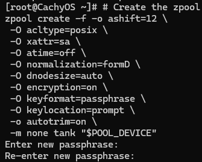

Password: dragon12

#### Explanation

- `zpool create -f`: Ensure pool creation even on disks not fully cleaned
- `-o ashift=12`: Force 4K sector alignment for optimal SSD/HDD performance
- `-O acltype=posix`: Enable fine-grained permission control
- `-O xattr=sa`: Store extended attributes in the system attribute area instead of the filesystem
- `-O atime=off`: Disable access time updates to improve performance
- `-O normalization=formD`: Prevent filename encoding conflicts across systems
- `-O dnodesize=auto`: Improve performance for metadata-intensive workloads
- `-O encryption=on`: Enable native ZFS encryption
- `-O keyformat=passphrase`: Require user passphrase at boot
- `-O keylocation=prompt`: Prompt for key at startup
- `-o autotrim=on`: Maintain SSD performance and reduce write amplification
- `-m none`: Avoid conflicts with later dataset layout
- `tank "$POOL_DEVICE"`: “tank” is the pool name, followed by the device

### Create Datasets

#### Operations

```bash
zfs create -o mountpoint=none tank/ROOT -o encryption=on
zfs create -o mountpoint=/ -o canmount=noauto tank/ROOT/${ID} -o compression=zstd -o encryption=on
zfs create -o mountpoint=none tank/USERDATA -o encryption=on
zfs create -o mountpoint=/home tank/USERDATA/home -o compression=lz4 -o encryption=on
zfs create -o mountpoint=/root tank/USERDATA/root -o compression=lz4 -o encryption=on
zfs create -o mountpoint=none tank/var -o encryption=on
zfs create -o mountpoint=/var/log tank/var/log -o exec=off -o setuid=off -o compression=off -o encryption=on
zfs create -o mountpoint=/var/cache tank/var/cache -o compression=off -o encryption=on
zfs create -o mountpoint=/var/lib tank/var/lib -o compression=off -o encryption=on
zfs create -o mountpoint=/var/tmp tank/var/tmp -o exec=off -o setuid=off -o compression=off -o encryption=on
```

#### Example

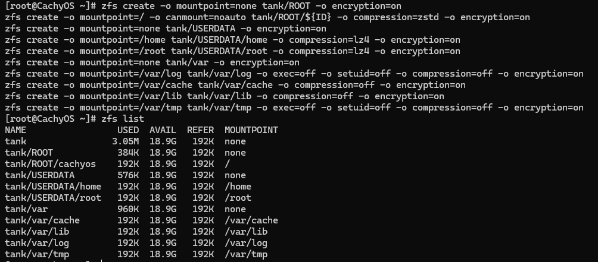

#### Explanation

- `-o mountpoint`: Defines the mount point; parent datasets should use `none`
- `tank/ROOT`: ZFS path following the mountpoint definition
- `-o exec=off`: Disable program execution
- `-o setuid=off`: Disable SUID
- `-o compression`: Enable disk compression
- `-o encryption=on`: Enable encryption

### Set Boot Root

#### Operations

```bash
# Set BootFS
zpool set bootfs=tank/ROOT/${ID} tank
```

#### Example


#### Explanation

BootFS = Default root filesystem pointer of the ZFS pool

### Relocate Pool Mount Point

#### Operations

```bash
# Export the ZFS pool named tank.
zpool export tank

# Import the ZFS pool named tank.
zpool import -N -R /mnt tank

# Unlock all datasets of tank.
zfs load-key -r tank
```

#### Example

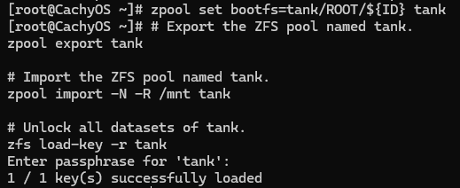

#### Explanation

Re-import the pool root mount point to `/mnt` from the live environment, so that it can be accessed during `chroot`

### Mount

#### Operations

```bash
# Mount ZFS
zfs mount tank/ROOT/${ID}
zfs mount tank/USERDATA/home
zfs mount tank/USERDATA/root
zfs mount tank/var/cache
zfs mount tank/var/lib
zfs mount tank/var/log
zfs mount tank/var/tmp
```

#### Example

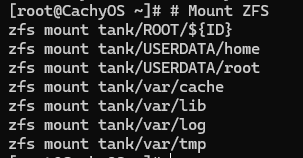

#### Explanation

These commands manually mount all ZFS datasets.

Without these mounts, subsequent `chroot` and bootloader configuration steps cannot proceed correctly.

### Update Device Nodes

#### Operations

```bash
# Update device symlinks
udevadm trigger
```

#### Example


#### Explanation

Force the system to rescan and update all device nodes and symlinks, reducing unexpected issues and ensuring reproducibility of the training process.

### Install System

#### Operations

```bash
# Install Arch System
echo 'Server = https://mirrors.aliyun.com/archlinux/$repo/os/$arch' > /etc/pacman.d/mirrorlist
pacman -Sy aria2 --noconfirm
pacman-key --keyserver hkps://keyserver.ubuntu.com --recv-keys F3B607488DB35A47
pacman-key --lsign-key F3B607488DB35A47

tee /etc/pacman.d/cachyos-${ARCH}-mirrorlist > /dev/null <<EOF
## Cloudflare R2
Server = https://cdn.cachyos.org/repo/\$arch_$ARCH/\$repo

## Germany
Server = https://aur.cachyos.org/repo/\$arch_$ARCH/\$repo
Server = https://mirror.cachyos.org/repo/\$arch_$ARCH/\$repo
Server = https://build.cachyos.org/repo/\$arch_$ARCH/\$repo
EOF
tee /etc/pacman.d/cachyos-mirrorlist > /dev/null <<EOF
## Cloudflare R2
Server = https://cdn.cachyos.org/repo/\$arch/\$repo

## Germany
Server = https://aur.cachyos.org/repo/\$arch/\$repo
Server = https://mirror.cachyos.org/repo/\$arch/\$repo
Server = https://build.cachyos.org/repo/\$arch/\$repo
EOF
tee /etc/pacman.conf > /dev/null <<EOF
[options]
HoldPkg     = pacman glibc
Architecture = auto
Color
ILoveCandy
VerbosePkgLists
DisableDownloadTimeout
ParallelDownloads = 16
DownloadUser = alpm
SigLevel = Required DatabaseOptional
LocalFileSigLevel = PackageRequired

[cachyos-v4]
Include = /etc/pacman.d/cachyos-v4-mirrorlist

[cachyos-core-v4]
Include = /etc/pacman.d/cachyos-v4-mirrorlist

[cachyos-extra-v4]
Include = /etc/pacman.d/cachyos-v4-mirrorlist

[cachyos]
Include = /etc/pacman.d/cachyos-mirrorlist

[core]
Include = /etc/pacman.d/mirrorlist

[extra]
Include = /etc/pacman.d/mirrorlist
EOF

mkdir -p /root/aria2-download/
tee /root/aria2-download/updateURLs.txt > /dev/null <<EOF
https://cdn.cachyos.org/repo/x86_64/cachyos/cachyos.db
https://cdn.cachyos.org/repo/x86_64/cachyos/cachyos.db.sig
https://mirrors.aliyun.com/archlinux/core/os/x86_64/core.db
https://mirrors.aliyun.com/archlinux/extra/os/x86_64/extra.db
https://cdn.cachyos.org/repo/x86_64_$ARCH/cachyos-$ARCH/cachyos-$ARCH.db
https://cdn.cachyos.org/repo/x86_64_$ARCH/cachyos-$ARCH/cachyos-$ARCH.db.sig
https://cdn.cachyos.org/repo/x86_64_$ARCH/cachyos-core-$ARCH/cachyos-core-$ARCH.db
https://cdn.cachyos.org/repo/x86_64_$ARCH/cachyos-core-$ARCH/cachyos-core-$ARCH.db.sig
https://cdn.cachyos.org/repo/x86_64_$ARCH/cachyos-extra-$ARCH/cachyos-extra-$ARCH.db
https://cdn.cachyos.org/repo/x86_64_$ARCH/cachyos-extra-$ARCH/cachyos-extra-$ARCH.db.sig
EOF

aria2c -j10 -x4 -s4 -i /root/aria2-download/updateURLs.txt -d /var/lib/pacman/sync/ --retry-wait=5 --max-tries=5 --user-agent='Mozilla/5.0' --allow-overwrite=true

pacman --root /mnt -Sp linux-firmware intel-ucode linux-cachyos-hardened-zfs base zfs-dkms zfs-utils networkmanager linux-cachyos-hardened-headers \
| grep -v '^file://' \
| awk '{ print; print $0".sig" }' \
| aria2c -j16 -x16 -s16 -d /mnt/var/cache/pacman/pkg --retry-wait=5 --max-tries=5 --user-agent='Mozilla/5.0' --allow-overwrite=true --min-split-size=1M -i -

pacstrap /mnt linux-cachyos-hardened-zfs linux-cachyos-hardened-headers base zfs-dkms zfs-utils linux-firmware intel-ucode networkmanager zfsbootmenu --noconfirm

cp /etc/hostid /mnt/etc
arch-chroot /mnt
```

#### Example

Configure base mirror & download aria2 & trust public key
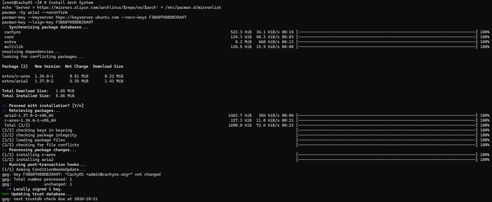

Configure V4 mirrors
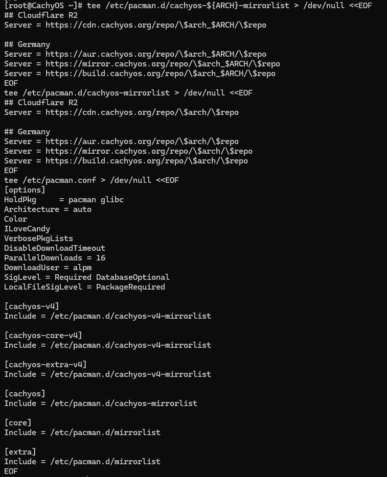

Configure package database URLs
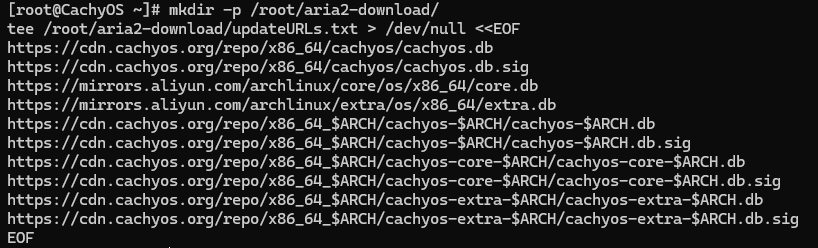

Download package databases
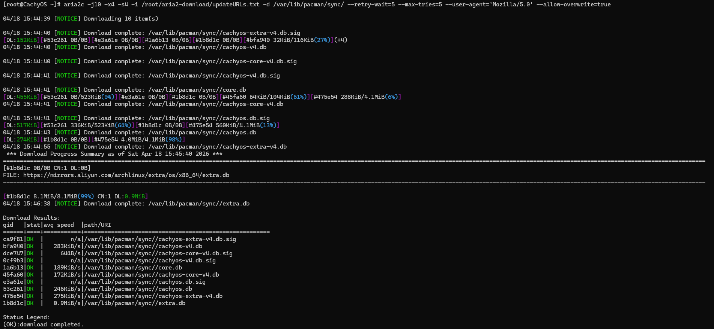

Copy cache
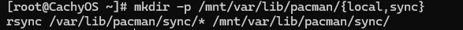

Download required packages
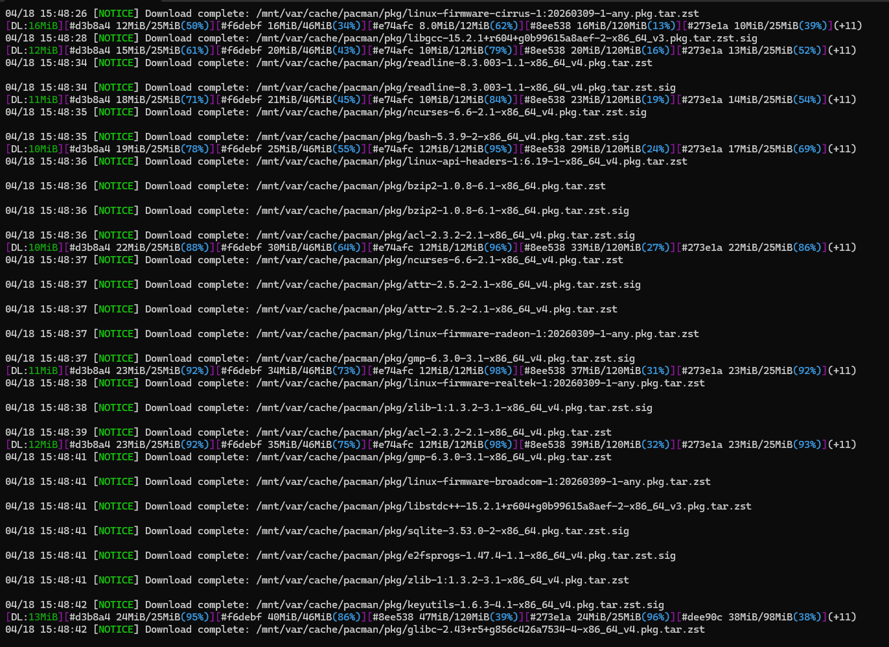
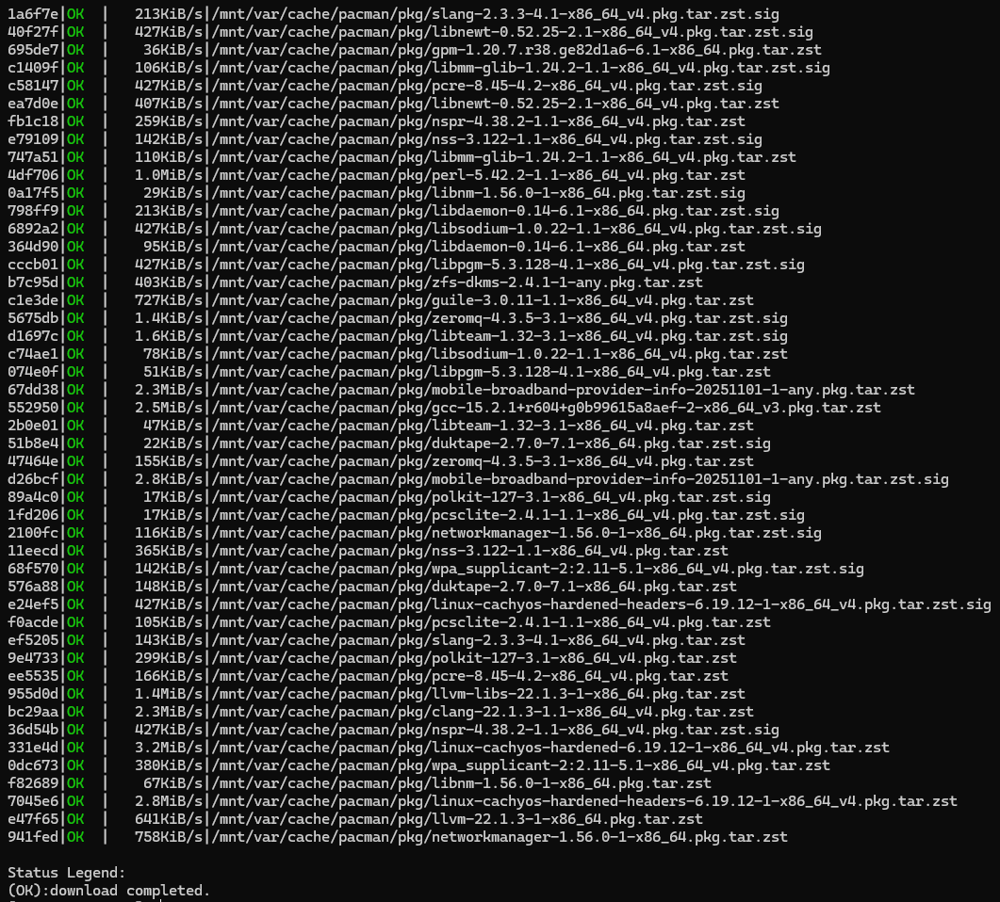

Install system
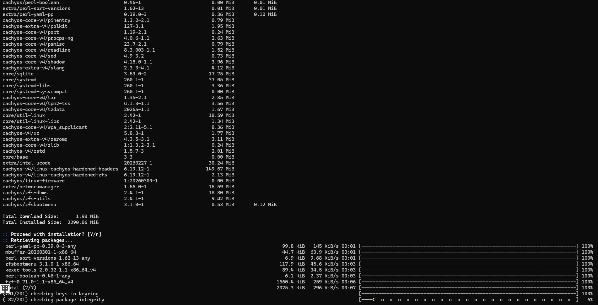
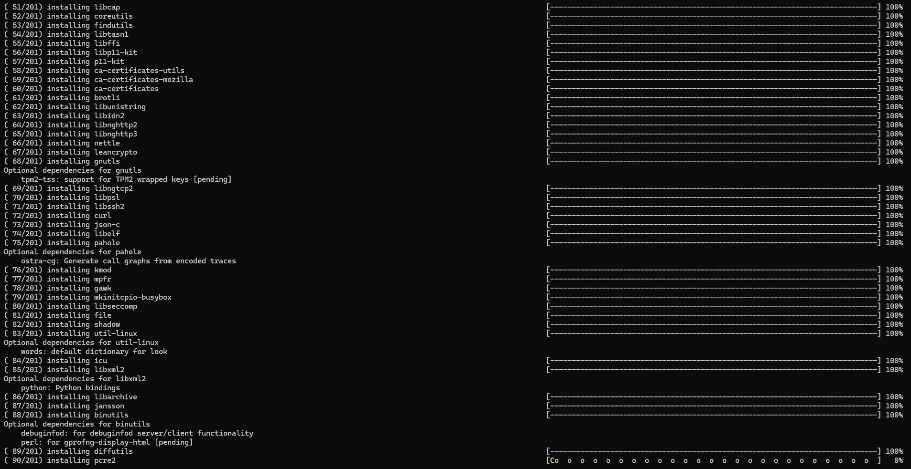
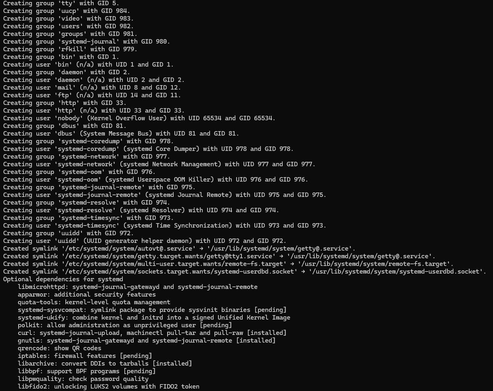
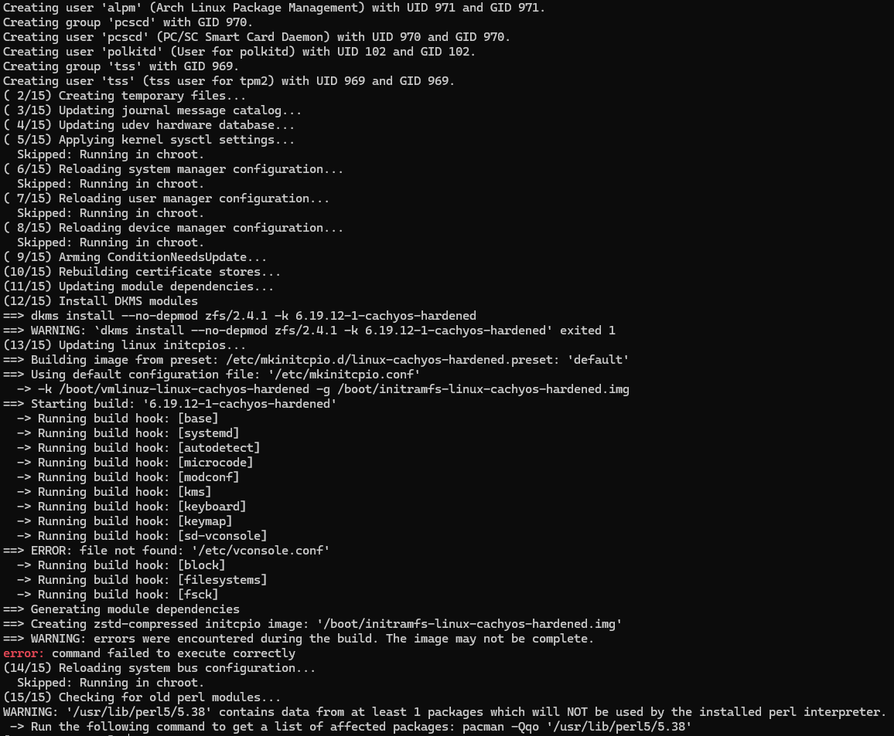

Copy hostid & enter/exit chroot
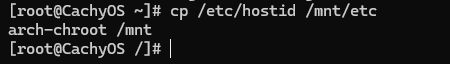

#### Explanation

Configure base mirror, download aria2, and trust public key

- Set Arch mirror (Aliyun)
- Install aria2 to accelerate downloads
- Import and trust CachyOS repository signing key

Configure V4 mirrors

- These mirrors are used to download CachyOS v4 optimized packages (AVX‑512)

Configure package database URLs

- URLs prepared for aria2 to batch download database files

Download package databases

- Multi-threaded download of `.db` and `.db.sig` files
- Bypass pacman’s built-in downloader for speed

Copy cache

- Copy live system’s database into target system
- Allows pacman in `/mnt` environment to use database without re-downloading

Download required packages

- Generate download URLs for kernel, headers, ZFS modules, base group, firmware/microcode, and networking tools
- Use 16 threads, high concurrency for faster download

Install system

- Core step of installing the Arch-based system

Copy hostid & enter/exit chroot

- ZFS requires hostid to identify the pool → `cp /etc/hostid /mnt/etc`
- Enter chroot with `arch-chroot /mnt` to perform subsequent configuration

### Configure ESP Partition

#### Operations

```bash
# ESP
zfs set org.zfsbootmenu:commandline="systemd.show_status=1 systemd.log_level=info" tank/ROOT
pacman -S dosfstools --noconfirm
mkfs --type vfat -F 32 -I "$BOOT_DEVICE"
mkdir -p /efi
mount "$BOOT_DEVICE" /efi
```

#### Example

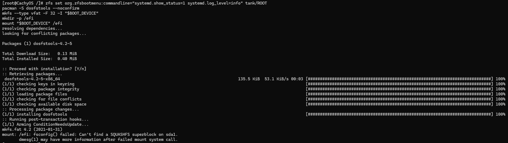

#### Explanation

This step creates and mounts the FAT32 ESP partition required for UEFI and sets ZFSBootMenu boot parameters.

### Configure New System Environment

#### Operations

```bash
# Configure the new OS
echo 'Server = https://mirrors.aliyun.com/archlinux/$repo/os/$arch' > /etc/pacman.d/mirrorlist
pacman -Sy aria2 --noconfirm
pacman-key --recv-keys F3B607488DB35A47 --keyserver keyserver.ubuntu.com
pacman-key --lsign-key F3B607488DB35A47
tee /etc/pacman.d/cachyos-${ARCH}-mirrorlist > /dev/null <<EOF
## Cloudflare R2
Server = https://cdn.cachyos.org/repo/\$arch_$ARCH/\$repo

## Germany
Server = https://aur.cachyos.org/repo/\$arch_$ARCH/\$repo
Server = https://mirror.cachyos.org/repo/\$arch_$ARCH/\$repo
Server = https://build.cachyos.org/repo/\$arch_$ARCH/\$repo
EOF
tee /etc/pacman.d/cachyos-mirrorlist > /dev/null <<EOF
## Cloudflare R2
Server = https://cdn.cachyos.org/repo/\$arch/\$repo

## Germany
Server = https://aur.cachyos.org/repo/\$arch/\$repo
Server = https://mirror.cachyos.org/repo/\$arch/\$repo
Server = https://build.cachyos.org/repo/\$arch/\$repo
EOF
tee /etc/pacman.conf > /dev/null <<EOF
[options]
HoldPkg     = pacman glibc
Architecture = auto
Color
ILoveCandy
VerbosePkgLists
DisableDownloadTimeout
ParallelDownloads = 16
DownloadUser = alpm
SigLevel = Required DatabaseOptional
LocalFileSigLevel = PackageRequired

[cachyos-v4]
Include = /etc/pacman.d/cachyos-v4-mirrorlist

[cachyos-core-v4]
Include = /etc/pacman.d/cachyos-v4-mirrorlist

[cachyos-extra-v4]
Include = /etc/pacman.d/cachyos-v4-mirrorlist

[cachyos]
Include = /etc/pacman.d/cachyos-mirrorlist

[core]
Include = /etc/pacman.d/mirrorlist

[extra]
Include = /etc/pacman.d/mirrorlist
EOF
mkdir -p /root/aria2-download/
tee /root/aria2-download/updateURLs.txt > /dev/null <<EOF
https://cdn.cachyos.org/repo/x86_64/cachyos/cachyos.db
https://cdn.cachyos.org/repo/x86_64/cachyos/cachyos.db.sig
https://mirrors.aliyun.com/archlinux/core/os/x86_64/core.db
https://mirrors.aliyun.com/archlinux/extra/os/x86_64/extra.db
https://cdn.cachyos.org/repo/x86_64_$ARCH/cachyos-$ARCH/cachyos-$ARCH.db
https://cdn.cachyos.org/repo/x86_64_$ARCH/cachyos-$ARCH/cachyos-$ARCH.db.sig
https://cdn.cachyos.org/repo/x86_64_$ARCH/cachyos-core-$ARCH/cachyos-core-$ARCH.db
https://cdn.cachyos.org/repo/x86_64_$ARCH/cachyos-core-$ARCH/cachyos-core-$ARCH.db.sig
https://cdn.cachyos.org/repo/x86_64_$ARCH/cachyos-extra-$ARCH/cachyos-extra-$ARCH.db
https://cdn.cachyos.org/repo/x86_64_$ARCH/cachyos-extra-$ARCH/cachyos-extra-$ARCH.db.sig
EOF
pacman -S aria2 openssh --noconfirm
echo 'root:dragon' | chpasswd
sed -i \
    -e 's/^#PasswordAuthentication yes/PasswordAuthentication yes/' \
    -e 's/^#PermitRootLogin prohibit-password/PermitRootLogin yes/' \
    /etc/ssh/sshd_config
systemctl enable NetworkManager sshd
```

#### Example

Since part of the content is highly repetitive with earlier steps, examples are not repeated here.

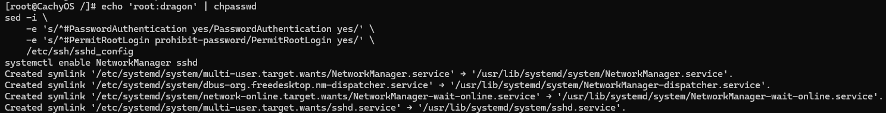

#### Explanation

This part largely repeats earlier steps, so examples and explanations are abbreviated.

- `echo 'root:dragon' | chpasswd`: Set the root password to `dragon`
- `sed -i ...`: Configure root remote login permissions
- `systemctl enable NetworkManager sshd`: Enable networking and SSH services

### Configure Boot

#### Operations

```bash
aria2c https://get.zfsbootmenu.org/efi -d /efi/EFI/zbm --min-split-size=1M
pacman -Sp efibootmgr \
| grep -v '^file://' \
| awk '{ print; print $0".sig" }' \
| aria2c -j16 -x16 -s16 -d /var/cache/pacman/pkg --retry-wait=5 --max-tries=5 --user-agent='Mozilla/5.0' --allow-overwrite=true --min-split-size=1M -i -

pacman -S efibootmgr --noconfirm
EFI_NAME=$(ls /efi/EFI/zbm/)
efibootmgr --create --disk "$DISK" --part "$BOOT_PART" --label 'ZFSBootMenu' --loader "\EFI\zbm\\${EFI_NAME}"
```

#### Example

This download operation has a high probability of failure under poor network conditions

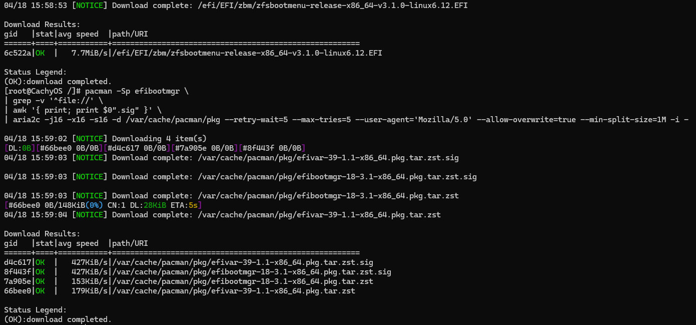
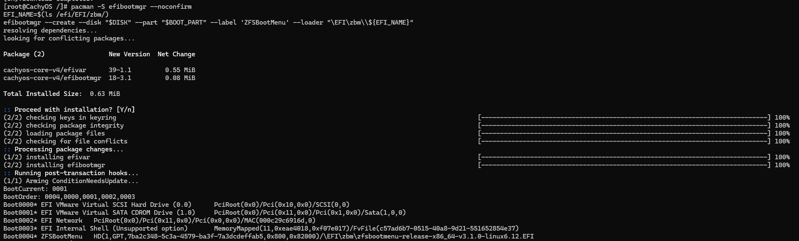

#### Explanation

Download the ZFSBootMenu EFI file, install `efibootmgr`, and create a UEFI boot entry for ZFSBootMenu.

### Reboot System

#### Operations

```bash
exit
umount -n -R /mnt
zpool export tank
sync
reboot
```

#### Example

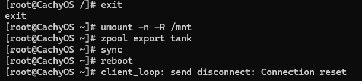

#### Explanation

Safely exit `chroot`, unmount all mount points, export the ZFS pool (the proper way to exit), and reboot into the newly installed ZFS system.

### End

Boot interface:

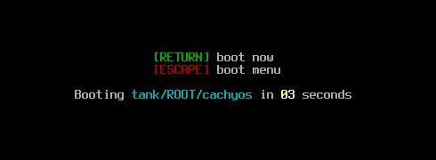

Password prompt:


At this point, the Arch Linux system installation based on ZFS full‑disk encryption and CPU instruction set optimization is complete. The system can boot normally and prompt for password unlock.

## Training Results

### ZFS Full‑Disk Encryption

Successfully deployed an Arch Linux system with ZFS full‑disk encryption, completing the entire process from disk initialization, partitioning, ZFS pool creation, dataset planning, to system installation.

The root filesystem resides in the encrypted ZFS pool, requiring a password at boot for unlocking.

### Instruction Set Optimization

Achieved deep CPU instruction set optimization.
    By setting `ARCH='v4'` and using the `linux-cachyos-hardened-zfs` kernel, the system enables full AVX‑512 instruction set support on the Intel Core i5‑1135G7, improving performance for compute‑intensive tasks.

### ZFS Root Boot Support

Built a bootable ZFSBootMenu environment.
    Successfully configured the EFI system partition, deployed the ZFSBootMenu bootloader, supporting multi‑kernel/snapshot boot, encryption unlock prompt, system log output, and other advanced features.

### Remote Login

System supports remote management and maintenance.
    Enabled SSH service with root login, configured NetworkManager, ensuring the system can be accessed via network immediately after installation for subsequent operations and debugging.

## Training Reflections

### ZFS Advantages but High Complexity

ZFS features such as native encryption, snapshots, compression, and self‑healing greatly enhance system robustness and flexibility.
    However, initialization, mounting, and boot configuration require strict adherence to sequence; even minor mistakes can prevent booting.

### Mirror and Download Tool Optimization Greatly Improves Efficiency

Under identical network conditions, using aria2 to download package databases and packages is about 15× faster than pacman.
    In practice, installation time was reduced from 20 minutes to about 1 minute 20 seconds, showing clear advantages in large‑scale deployments.

### Balancing Security and Performance

Full‑disk encryption ensures data security but requires manual password entry at each boot.
    Disabling `atime`, enabling `autotrim`, and applying compression strategies improve SSD performance, but must be tuned according to workload.

### High Reproduction Difficulty

Occasional unexplained errors may occur.

There are strict CPU requirements (e.g., AVX‑512 support).

Students can use fallback solutions to bypass CPU limitations, such as setting `ARCH='v3'` instead of `ARCH='v4'` to support a wider range of processors.
